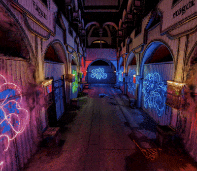

# Marble Gaussian Splat Environmental Transitions



This project is a web-based 3D application built with React and Three.js that
demonstrates animated transitions between multiple Gaussian Splat scenes.

**[Live Demo](https://willemhelmet.github.io/splat-environmental-transitions/)**

## Process

### Project Goals

The goal of this project was to create multiple consistent Gaussian Splat environments.
In order to showcase the consistency between splats, I created a transition
effect that highlighted the architectural similarity between the three environments.

### Generating Environments

While Marble was in beta, I struggled to create consistent Gaussian Splats that
respected the source image/3D model scale and architectural details.
In an earlier experiment, [my previous attempt](https://github.com/willemhelmet/consistent-marble-splats)
involved building a 3D scene in Blender, and rendering an equirectangular 360 photo
to be used as the "ground truth" for my Gaussian Splat Environments.
I used a separate AI image-editing program to transform the initial photo into a
new environment, and passed both images into Marble to generate the Gaussian
Splat Environment. A large amount of my time for this project was trying to
wrangle the two environments into appearing as if they were one and the same.
It was not trivial!

For this project, the environments were made using
[Marble](https://marble.worldlabs.ai/)'s new "Chisel" feature. I used a 3D model
of the popular "Sponza" environment to generate a depth-map, which was passed
along with a text-prompt to build the 3D scenes. Overall the process was much
more intuitive and led to environments that needed little-to-no extra processing.

### Optimizing Gaussian Splats

Since I wanted to showcase multiple environments, and have this experience run
on a multitude of devices, I would need to optimize my Gaussian Splats quite a
bit from their original state.

After downloading the `.ply` files from Marble, I used
[`splat-transform`](https://github.com/playcanvas/splat-transform)
to remove every splat that was below 50% opacity:

```sh
splat-transform input.ply -V opacity,gt,0.5 output.ply
```

To remove additional color data I got rid of all spherical harmonics:

```sh
splat-transform input.ply --filter-harmonics 2 output.ply
```

And then I converted the `.ply` splat into a `.sog`:

```sh
splat-transform input.ply output.sog
```

This led to a ~50% reduction in number of splats, and a ~100% reduction of file-size.

### Transition Effect

To render the Guassian Splats on the web, I used [Spark](https://sparkjs.dev/),
a new Gaussian Splat renderer for Three.js. A core pillar of Spark is a shader-graph
system called `dyno`, which allows you to write GLSL code for your Splats.
Using `dyno`, I was able to create a generic `<Splat>` component that contained
all the necessary GLSL code for all three environments. A parent
component handled the state, and animation values, which were passed into
the shader code.

## How to Run Locally

1. **Clone the repository:**

   ```sh
   git clone https://github.com/willemhelmet/splat-environmental-transitions.git
   ```

2. **Navigate to the project directory:**

   ```sh
   cd splat-environmental-transitions
   ```

3. **Install dependencies:**

   ```sh
   npm install
   ```

4. **Run the development server:**

   ```sh
   npm run dev
   ```

The application will be available at `http://localhost:5173`
(or the next available port).

## Credits

["Sponza Palace"](https://skfb.ly/pxp8q) by abhayexe is
licensed under [Creative Commons Attribution](http://creativecommons.org/licenses/by/4.0/)

